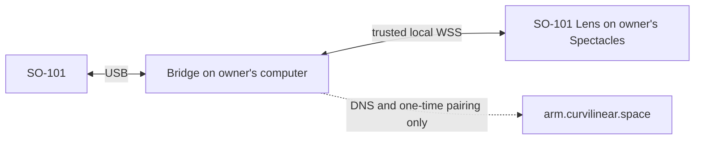

# SO-101 Helper

SO-101 Lens ↔ local arm helper.



## Setup

macOS · Python 3.11 · same Wi-Fi · clear workspace · power disconnect.

```bash
git clone https://github.com/a-sumo/so101-helper.git
cd so101-helper
python3.11 -m venv .venv
.venv/bin/pip install --upgrade pip
.venv/bin/pip install -r requirements-bridge.txt
.venv/bin/python bridge/local_wss_helper.py setup --email owner@example.com
```

First pairing:

```bash
# Terminal 1
.venv/bin/python so101_bridge.py --host 127.0.0.1

# Terminal 2
.venv/bin/python bridge/local_wss_helper.py serve --pair
```

1. Lens PIN: Terminal 2's 8 digits.
2. Terminal 1: `ARM`.
3. Terminal 2: `enable`.
4. **Operate → Real arm → ARM LIVE**.
5. Small motion. Match arm / twin direction.

Later:

```bash
.venv/bin/python bridge/local_wss_helper.py serve
```

Reference: [real arm](docs/real-arm.md) · [calibration](docs/calibration.md) · [assembly](docs/assembly-animation.md)

Web tools: [so101.curvilinear.space](https://so101.curvilinear.space) · Local:
`npm install && npm run dev`

Resources: [LeRobot SO-101 guide](https://huggingface.co/docs/lerobot/main/en/so101) ·
[LeRobot repository](https://github.com/huggingface/lerobot) ·
[Seeed servo driver board](https://wiki.seeedstudio.com/bus_servo_driver_board/)
