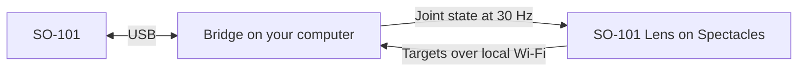

# SO-101 Helper

Use your SO-101 with Real arm mode.

1. Complete the [SO-101 assembly and calibration guide](https://huggingface.co/docs/lerobot/main/en/so101).
2. Connect USB logic power and DC servo power.
3. Run `uv run --python 3.11 --with-requirements requirements-bridge.txt python so101_bridge.py`.
4. Enter the printed bridge address in the Lens.
5. Clear the robot workspace, then type `ARM` when the bridge reports the Lens connection.
6. Open **Operate**, select **Real arm**, and align the virtual base with the physical base.

Web tools: `npm install && npm run dev`

Resources: [LeRobot SO-101 guide](https://huggingface.co/docs/lerobot/main/en/so101) · [LeRobot repository](https://github.com/huggingface/lerobot) · [Seeed servo driver board](https://wiki.seeedstudio.com/bus_servo_driver_board/) · [Seeed schematic](https://files.seeedstudio.com/wiki/bus_servo_driver_board/202004237_Servo_Driver_Board_for_Seeed_Studio_XIAO_SCH_PDF_250225.pdf)
