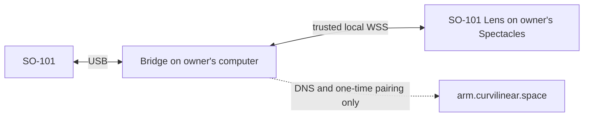

# SO-101 Helper

Use your own SO-101 from the SO-101 Lens on Spectacles. Robot commands and
telemetry stay between Spectacles and the computer connected to the arm on the
same LAN.



`arm.curvilinear.space` is not a robot relay: it never receives commands,
telemetry, or the locally generated TLS private key. Every arm owner installs
and runs this repository on their own computer. No router port forwarding and
no Cloudflare account are required.

## Practical setup

The trusted helper flow is currently validated on macOS with Python 3.11 and
requires the computer and Spectacles to be on the same non-isolated LAN.

One time on the arm computer:

```bash
git clone https://github.com/a-sumo/so101-helper.git
cd so101-helper
python3.11 -m venv .venv
.venv/bin/pip install --upgrade pip
.venv/bin/pip install -r requirements-bridge.txt
.venv/bin/python bridge/local_wss_helper.py setup --email owner@example.com
```

For the first connection, use two terminals:

```bash
# Terminal 1: USB bridge, reachable only by the local helper
.venv/bin/python so101_bridge.py --host 127.0.0.1

# Terminal 2: trusted LAN endpoint and first-time pairing code
.venv/bin/python bridge/local_wss_helper.py serve --pair
```

Then:

1. Launch the Lens on physical Spectacles. The system PIN keyboard appears
   inside the Lens; it does not appear in Cloudflare or Lens Studio.
2. Enter the eight-digit code printed in Terminal 2. It expires after ten
   minutes and works once.
3. When Terminal 1 reports the Lens connection, clear the workspace and type
   `ARM`. This preserves the bridge's local torque confirmation.
4. In Terminal 2, type `enable`. The helper starts disarmed and blocks motion
   until this second local owner confirmation.
5. In the Lens, open **Operate**, select **Real arm**, and wait for **ARM LIVE**
   before making a small first motion.

Later sessions do not need another pairing code unless the Lens credential was
cleared. Run the same bridge command and run the helper without `--pair`:

```bash
.venv/bin/python bridge/local_wss_helper.py serve
```

The complete prerequisites, firewall/network notes, recovery commands, and
safety behavior are in [docs/real-arm.md](docs/real-arm.md).

Web tools: [so101.curvilinear.space](https://so101.curvilinear.space) · Local:
`npm install && npm run dev`

Resources: [LeRobot SO-101 guide](https://huggingface.co/docs/lerobot/main/en/so101) ·
[LeRobot repository](https://github.com/huggingface/lerobot) ·
[Seeed servo driver board](https://wiki.seeedstudio.com/bus_servo_driver_board/)
